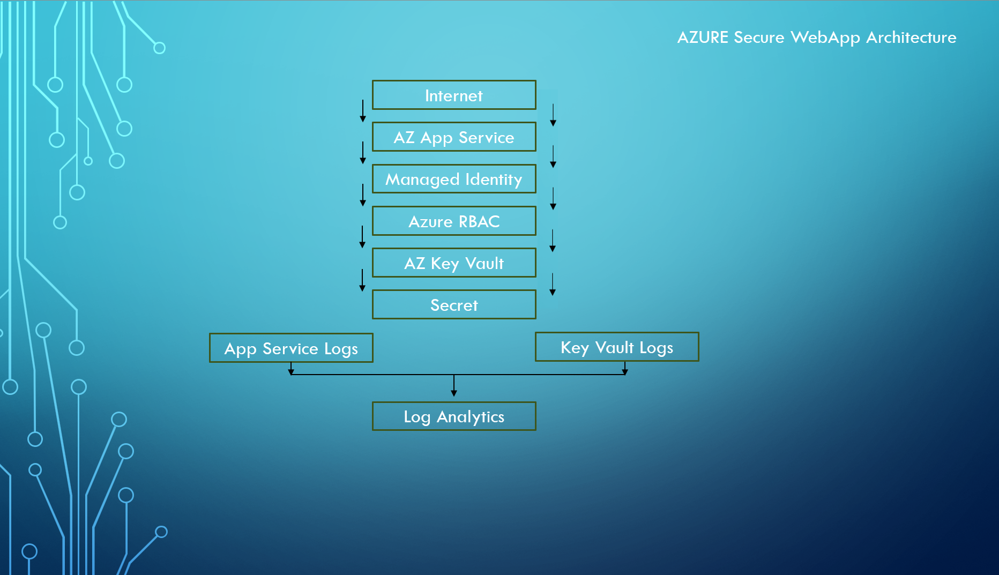
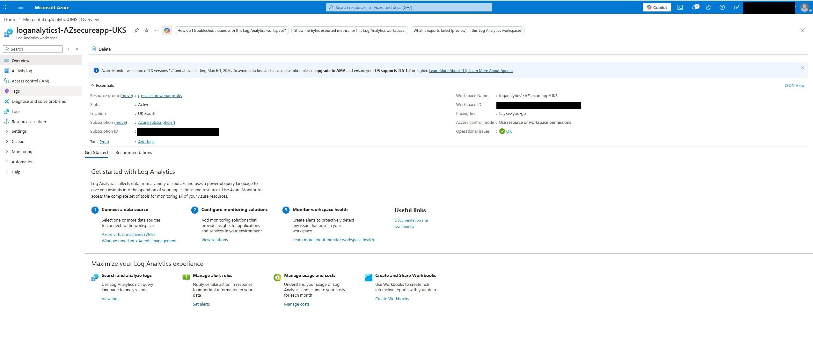
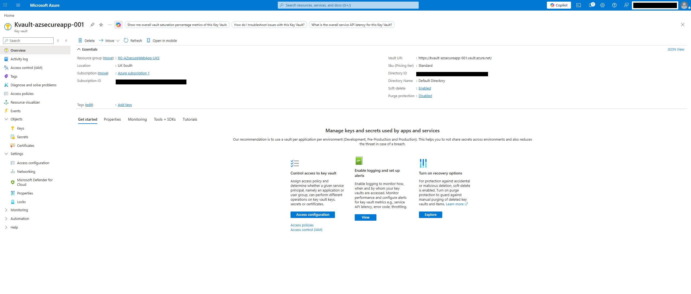
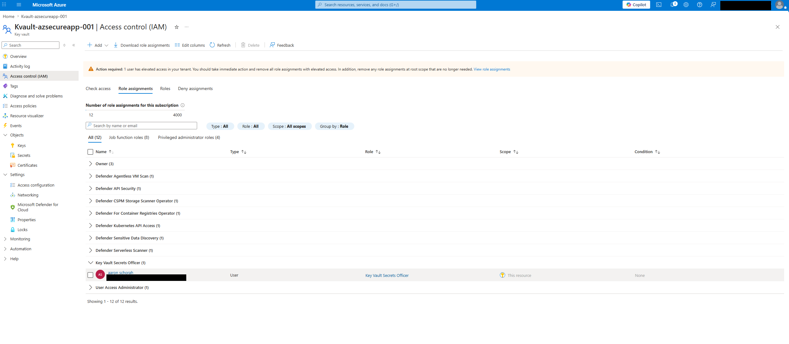
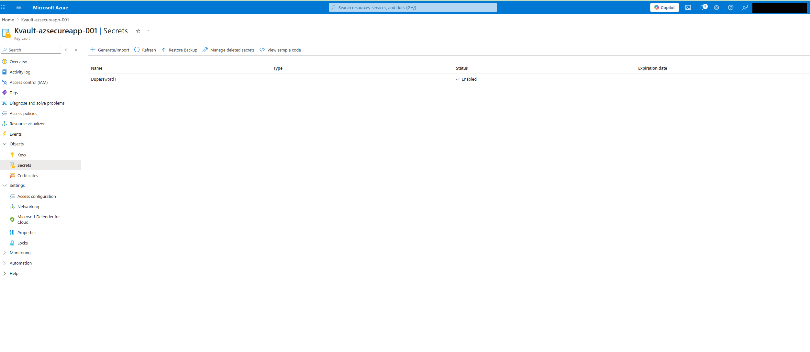
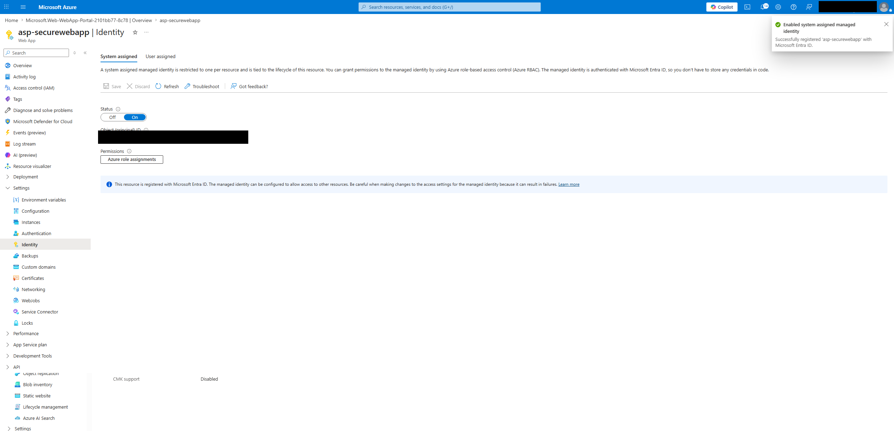
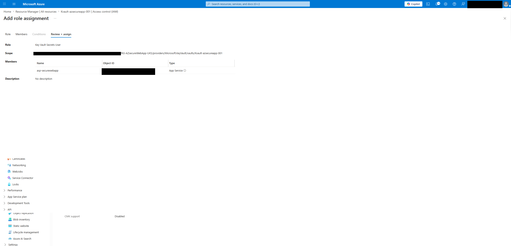
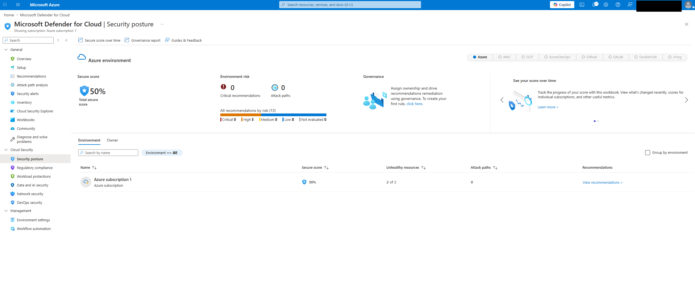
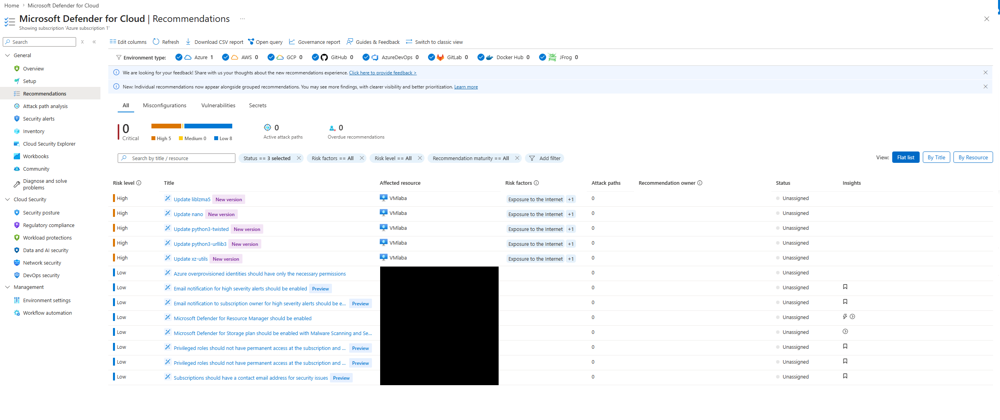

# azure-secure-webapp-project
Secure Azure web application environment demonstrating Managed Identity, Azure Key Vault, RBAC, Log Analytics and Microsoft Defender for Cloud.

## Overview

-Azure Secure Web Application Project
This project demonstrates the deployment and configuration of a secure Azure web application environment using Azure App Service, Azure Key Vault, Managed Identity, Role-Based Access Control (RBAC), Log Analytics and Microsoft Defender for Cloud.
The objective was to showcase practical Azure administration and security skills aligned with the AZ-104 and AZ-500 certification paths. The project focuses on secure secret management, least-privilege access control, monitoring, auditing and security posture assessment.
Key security features include Managed Identity authentication, Azure Key Vault RBAC permissions, centralized logging through Log Analytics and security recommendations provided by Microsoft Defender for Cloud.

## Architecture

## Technologies Used
- Azure App Service
- Azure Key Vault
- Azure RBAC
- Managed Identity
- Azure Storage Account
- Log Analytics Workspace
- Azure Monitor
- Microsoft Defender for Cloud

## Security Features
This project was designed with security as a primary focus.

- System Assigned Managed Identity was enabled on the Azure App Service.
- Azure Key Vault was configured using the RBAC permission model.
- Least-privilege access was implemented using the Key Vault Secrets User role.
- Secrets were stored securely in Azure Key Vault instead of application configuration files.
- Microsoft Defender for Cloud was used to assess the security posture of the environment.

## Monitoring and Logging
Diagnostic settings were configured to send logs from Azure resources to a Log Analytics Workspace.

This enables:

- Centralised log collection
- Security auditing
- Operational monitoring
- Future alerting capabilities

## Challenges Encountered

- Key Vault RBAC Permissions
Initially, secret creation was not possible because the Key Vault was configured to use Azure RBAC rather than Access Policies. A Key Vault Administrator role assignment was required before secrets could be created.

-Managed Identity Access
The App Service managed identity required explicit assignment of the Key Vault Secrets User role before access to secrets could be granted.

-Regional Deployment Quota
App Service deployment in UK South failed due to subscription quota restrictions. The workload was redeployed in UK West.

## Screenshots
### Log Analytics Workspace

### Azure Key Vault

### Key Vault RBAC Role Assignment

### Key Vault Secret

### Managed Identity

### Managed Identity Key Vault Access

### Defender for Cloud Secure Score

### Defender Recommendations

## Skills Demonstrated

- Azure App Service deployment
- Azure Key Vault configuration
- Azure RBAC administration
- Managed Identity implementation
- Secret management
- Log Analytics integration
- Diagnostic logging
- Microsoft Defender for Cloud
- Security posture assessment
- Azure troubleshooting and remediation

## Future Improvements
